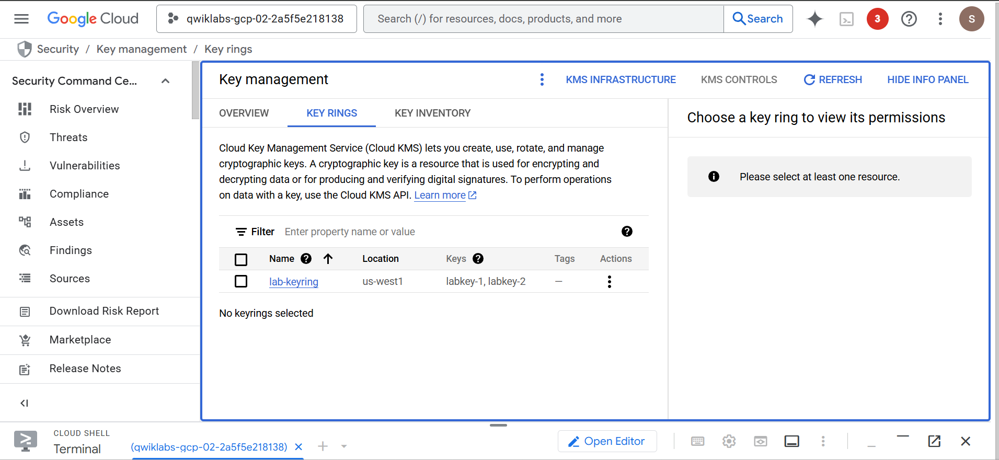
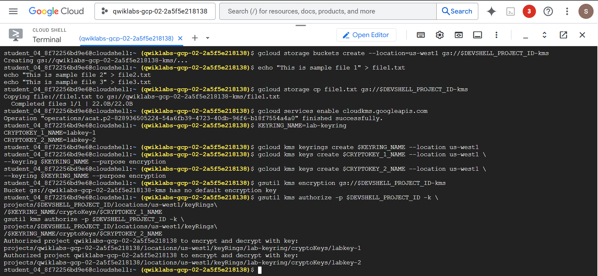
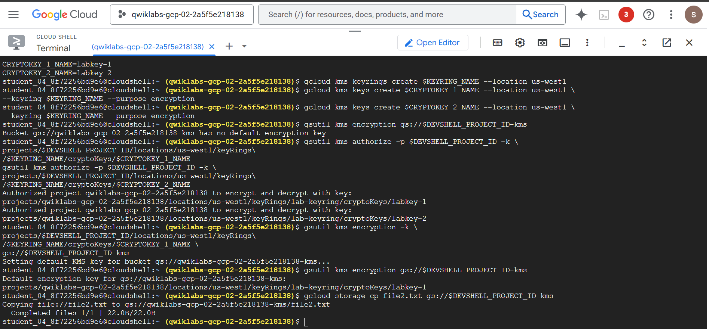
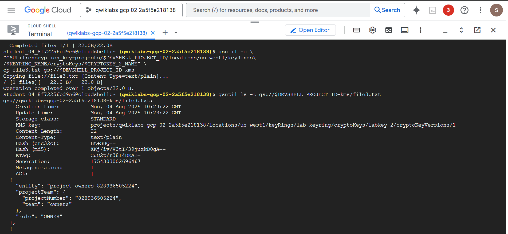
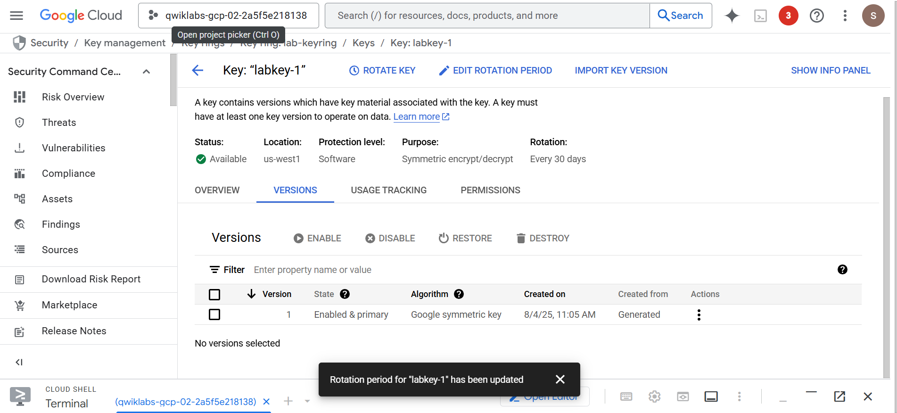
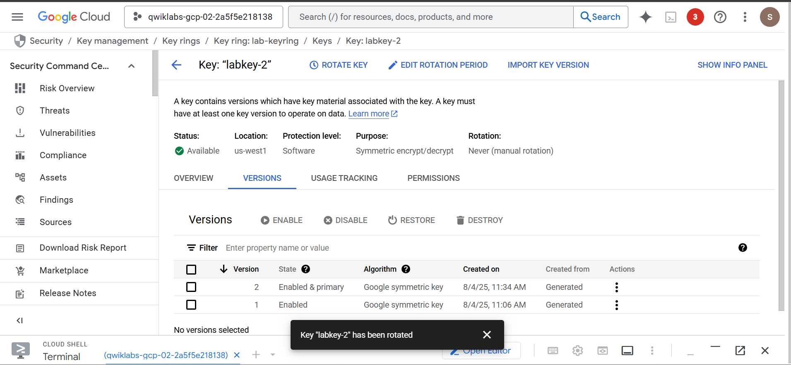
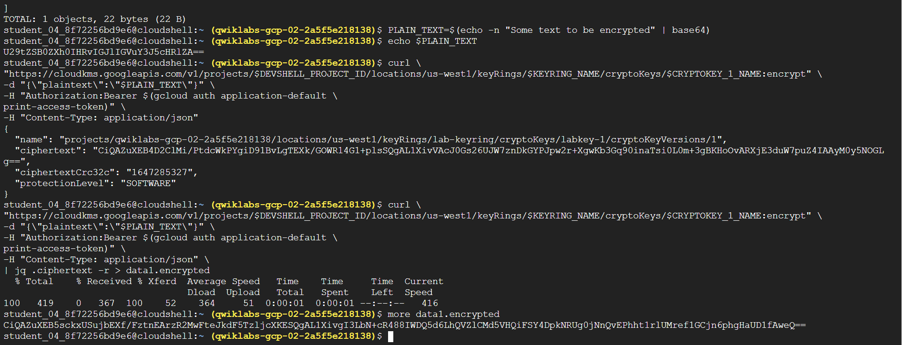
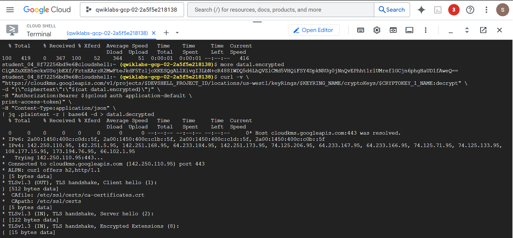
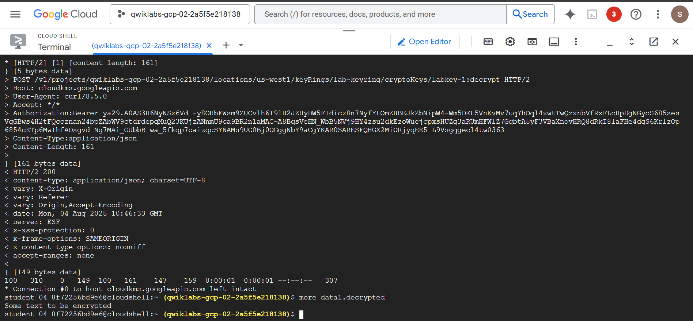

# Google-Cloud-KMS-lab
# Google Cloud KMS: Customer-Managed Encryption Keys (CMEK) Lab

This repository documents my hands-on lab with **Google Cloud Key Management Service (KMS)** and **Cloud Storage encryption** using **Customer-Managed Encryption Keys (CMEK)**.

 <


---

## 🚀 Lab Objectives

- ✅ Create and manage Cloud KMS KeyRings and CryptoKeys
- ✅ Set a default encryption key for Cloud Storage buckets
- ✅ Encrypt objects with specific keys (per-object encryption)
- ✅ Rotate encryption keys (manual and automatic)
- ✅ Use IAM to manage access to keys
- ✅ View audit logs for key activity
- ✅ Perform encryption/decryption via the REST API

---

## 🛠️ Tools & Services

- Google Cloud Platform (GCP)
- Cloud Storage
- Cloud Key Management Service (KMS)
- gsutil & gcloud CLI
- REST API + `curl` + `jq`

---

## 📂 Step-by-Step Instructions

### 1. Create Cloud Storage Bucket
```bash
gcloud storage buckets create --location=us-west1 gs://$DEVSHELL_PROJECT_ID-kms
```

### 2. Enable KMS API
```bash
gcloud services enable cloudkms.googleapis.com
```

### 3. Create KeyRing and CryptoKeys
```bash
gcloud kms keyrings create lab-keyring --location us-west1
gcloud kms keys create labkey-1 --location us-west1 --keyring lab-keyring --purpose encryption
gcloud kms keys create labkey-2 --location us-west1 --keyring lab-keyring --purpose encryption
```

### 4. Grant Permissions to Cloud Storage Service Account
```bash
gsutil kms authorize -p $DEVSHELL_PROJECT_ID -k \
projects/$DEVSHELL_PROJECT_ID/locations/us-west1/keyRings/lab-keyring/cryptoKeys/labkey-1
```

### 5. Set Default CMEK on Bucket
```bash
gsutil kms encryption -k \
projects/$DEVSHELL_PROJECT_ID/locations/us-west1/keyRings/lab-keyring/cryptoKeys/labkey-1 \
gs://$DEVSHELL_PROJECT_ID-kms
```

### 6. Encrypt Individual Object with a Different Key
```bash
gsutil -o "GSUtil:encryption_key=projects/$DEVSHELL_PROJECT_ID/locations/us-west1/keyRings/lab-keyring/cryptoKeys/labkey-2" \
cp file3.txt gs://$DEVSHELL_PROJECT_ID-kms
```

### 7. Key Rotation
```bash
gcloud kms keys versions create --keyring lab-keyring --location us-west1 --key labkey-2
```

### 8. Encrypt & Decrypt using REST API
# Encrypt
```bash
curl "https://cloudkms.googleapis.com/v1/projects/$DEVSHELL_PROJECT_ID/locations/us-west1/keyRings/lab-keyring/cryptoKeys/labkey-1:encrypt" \
-d "{\"plaintext\":\"$PLAIN_TEXT\"}" \
-H "Authorization:Bearer $(gcloud auth application-default print-access-token)" \
-H "Content-Type: application/json" | jq .ciphertext -r > data1.encrypted
```
# Decrypt
```bash
curl "https://cloudkms.googleapis.com/v1/projects/$DEVSHELL_PROJECT_ID/locations/us-west1/keyRings/lab-keyring/cryptoKeys/labkey-1:decrypt" \
-d "{\"ciphertext\":\"$(cat data1.encrypted)\"}" \
-H "Authorization:Bearer $(gcloud auth application-default print-access-token)" \
-H "Content-Type: application/json" | jq .plaintext -r | base64 -d > data1.decrypted

```

## 🧠 Lessons Learned

- Understood the difference between **Google-managed encryption keys** and **Customer-Managed Encryption Keys (CMEK)**.
- Fine-grained control of encryption is key for **compliance-focused environments**.
- **Key rotation** does *not* re-encrypt previously stored data — crucial insight for **incident response planning**.
- The **Cloud KMS REST API** is powerful and ideal for **automated encryption workflows**.

---

## 📸 Screenshots

### ✅ KMS KeyRing & Key Creation  


### ✅ Bucket Encryption Status  


### ✅ Object-Level Encryption Preview  


### ✅ Key Rotation History (Auto)  


### ✅ Key Rotation History (Manual)  


### ✅ REST API Encryption  
  


### ✅ REST API Decryption  


---

## 🏁 Final Thoughts

**Cloud KMS** is an essential tool for anyone working in **cloud security**. From securing storage buckets and managing encryption to auditing key usage, **CMEK** empowers you with control and visibility your workloads demand.

Whether you're just starting out or looking to strengthen your cloud security posture, mastering KMS is a step in the right direction.

---

## 🔗 Useful Resources

- [📘 Cloud KMS Documentation](https://cloud.google.com/kms/docs)
- [🔐 Google Cloud Storage Encryption](https://cloud.google.com/storage/docs/encryption)
- [🛡️ GCP IAM Best Practices](https://cloud.google.com/iam/docs/best-practices)


